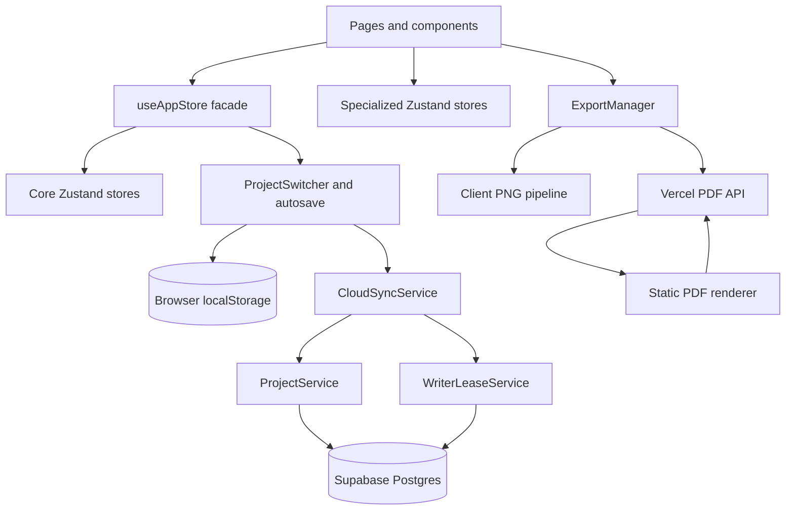
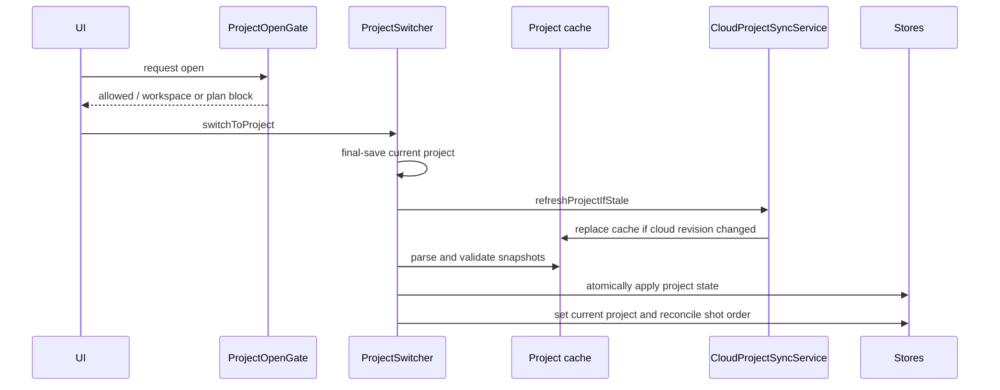
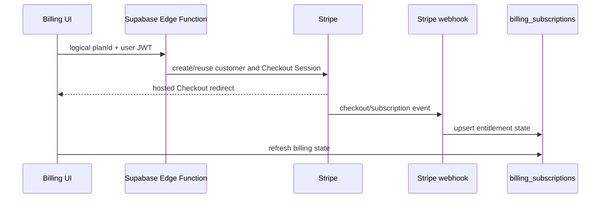

# StoryboardFlow Engineering Handbook

> Repository audit date: 2026-07-11  
> Verification pass: 2026-07-11 (code is authoritative; handbook updated only where inaccurate or incomplete)  
> Targeted update: 2026-07-27 (Stripe billing, Supabase Architecture, and Environment Configuration sections revised against the now-verified `invoice.paid` Pro welcome-email implementation; remainder of the document reflects the 2026-07-11 pass unless noted)  
> Scope: the checked-in repository as it exists on the audit date  
> Package: `storyboard-flow` 1.0.0

This handbook uses four evidence labels:

- **Confirmed** — directly observed in executable code or checked-in configuration.
- **Inference** — strongly suggested by code, naming, or documentation, but not fully provable from the repository.
- **Unknown** — the repository does not contain enough evidence.
- **Recommendation** — a proposed follow-up, not current behavior.

Unless marked otherwise, statements in this document are **Confirmed**. Existing documents were used as context, but code and deployed configuration files take precedence where they disagree.

## 1. Executive Summary

StoryboardFlow is a browser-based storyboard editor. It supports guest/local work, authenticated cloud projects, multi-page shot layouts, image editing, custom themes, PDF/PNG export, subscriptions, offline operation, and single-writer protection across tabs or devices.

The product is a React 18 single-page application built with Vite. The main editor lives at `/app`; `src/pages/Index.tsx` coordinates authentication, project availability, cloud loading, writer-lease state, and the editor UI. The application is local-first: Zustand persists working state in browser storage, while project-scoped snapshots are used for switching and cloud synchronization. Supabase provides authentication, Postgres, Storage, Realtime, RPCs, and Stripe-related Edge Functions, including a verified `invoice.paid`-triggered welcome-email path for new paid Pro subscriptions. Vercel hosts the SPA and a headless-Chromium PDF API.

Current maturity is mixed:

- The product has substantial production-oriented protections: validation, optimistic concurrency, writer leases, conflict dialogs, offline queues, billing gates, privacy-filtered analytics, and export readiness checks.
- Critical coordination code is concentrated in large files, and legacy and current state/export models coexist.
- The checked-in database migration history is incomplete.
- There is no automated test framework, test script, or checked-in CI workflow.
- TypeScript strictness is disabled.
- Some repository documentation no longer matches executable behavior. The root `README.md` is a Supabase CLI README, not a StoryboardFlow README.

Major technologies are React, TypeScript, Vite, Zustand, Supabase, Stripe, PostHog, Tailwind CSS, Radix/shadcn-style UI primitives, Puppeteer, and Vercel.

## 2. Technology Stack

| Area | Current implementation | Evidence/status |
|---|---|---|
| Frontend | React 18.2, TypeScript 5.2, React Router 6 | `package.json`, `src/App.tsx` |
| State | Zustand 4 with `persist` and Immer middleware | `src/store/` |
| Data fetching | Supabase client plus TanStack Query provider | Query provider exists; most audited data access calls Supabase directly |
| UI | Tailwind CSS 3, Radix UI, shadcn-style components, Lucide icons | `src/components/ui/`, `components.json` |
| Drag and drop | dnd-kit | `ShotGrid.tsx`, package dependencies |
| Backend | Supabase Postgres/Auth/Storage/Realtime/RPC and Edge Functions | `src/lib/supabase.ts`, `supabase/` |
| Hosting | Vercel SPA and Node.js serverless PDF endpoint | `vercel.json`, `api/export-pdf.ts` |
| Database | Supabase Postgres; JSONB project payloads | migrations and `ProjectService` |
| Authentication | Supabase email/password, Google OAuth, password recovery | `AuthService`, auth pages |
| Payments | Stripe Checkout, Customer Portal, subscriptions, webhooks | four Supabase Edge Functions |
| Transactional email | Resend HTTP API called with native `fetch` from `stripe-webhook`; no Resend SDK | `supabase/functions/stripe-webhook/index.ts` |
| Analytics | PostHog through an adapter; separate development-only telemetry | `src/services/analytics/`, `src/utils/telemetry.ts` |
| Object storage | Supabase bucket `project-images`; local base64/data URLs | `StorageService`, shot state |
| Build | Vite with SWC; main SPA and static PDF-render entries | `vite.config.ts` |
| PDF | Puppeteer Core, `@sparticuz/chromium`, `pdf-lib` | `api/export-pdf.ts` |
| PNG | Offscreen React render, DOM capture, canvas, JSZip fallback | `src/utils/export/` |
| Testing | Manual plans and ad hoc test files only | No test dependency or `test` script |
| Linting | ESLint 9 flat config with TypeScript and React plugins | `eslint.config.js` |
| Versioning | `package.json` is 1.0.0; optional analytics version via env | No release workflow or changelog confirmed |
| Package management | npm lockfile and Bun lockfile both exist | **Unknown** which is canonical |

Dependency versions are declared with caret ranges, so installed versions may be newer than their minimum declarations.

## 3. Repository Structure

| Path | Responsibility |
|---|---|
| `src/` | Browser application source: pages, components, stores, services, utilities, styles, configuration, and static PDF renderer |
| `src/pages/` | Route-level screens; `Index.tsx` is the editor state coordinator |
| `src/components/` | Feature UI, editor UI, dialogs, banners, export controls, and shared primitives |
| `src/components/ui/` | Radix/shadcn-style low-level components |
| `src/store/` | Zustand stores and the `useAppStore` composition facade |
| `src/services/` | Authentication, synchronization, storage, themes, billing access, analytics, leases, and project services |
| `src/utils/` | Project orchestration, persistence, validation, autosave, reconciliation, image processing, export, and diagnostics |
| `src/styles/` | Storyboard themes and centralized glassmorphism/semantic color definitions |
| `src/config/` | Route and billing constants |
| `src/lib/` | Supabase client and general library helpers |
| `src/hooks/` | Four hooks: network status, object URL/canvas cleanup, and toast (`use-toast.ts`; shadcn also ships a duplicate under `src/components/ui/use-toast.ts`) |
| `api/` | Vercel serverless functions; currently the PDF endpoint |
| `supabase/functions/` | Stripe Checkout, Portal, subscription-change, and webhook Edge Functions |
| `supabase/migrations/` | Partial database migration history: custom themes, writer leases/RPCs, and the lifecycle-email outbox table/RPC |
| `docs/` | Architecture, implementation, business, setup, test, and historical documentation |
| `product-discovery/` | Product, launch, analytics, testing, and Notion-oriented planning material; not runtime code |
| `public/` | Static web assets |
| `scripts/` | Administrative scripts: test-user deletion, and complimentary Pro beta-access grant/revoke/list |
| `.git-hooks/` | Documentation-maintenance reminder hook documentation |
| `.cursorrules` | Repository-specific implementation invariants and safety rules |
| `.vercel/` | Local Vercel project metadata; deployment details are not canonical documentation |
| `.chromium/` | Local Chromium-related cache/artifacts (**Inference**) |
| `dist/` | Generated Vite output; not an architectural source |
| `node_modules/` | Installed dependencies; not audited as application code |
| `reports/` | Report output area; purpose and lifecycle are **Unknown** |

Architectural layers:



### Service inventory

✅ Confirmed: `src/services/` contains **25** TypeScript modules (11 under `analytics/`).

| Module | Role |
|---|---|
| `authService.ts` | Supabase Auth, profiles, application sessions |
| `cloudSyncService.ts` | Local-first cloud save, in-memory offline project queue, conflict pause |
| `cloudProjectSyncService.ts` | Project list sync and stale refresh on open |
| `projectService.ts` | Supabase CRUD, validation, atomic save RPC |
| `writerLeaseService.ts` | Writer lease claim, 30s heartbeat, takeover |
| `cloudAccessService.ts` | Free/Pro cloud read/create gating (30s cache) |
| `projectOpenGate.ts` | Typed blocks before opening a project |
| `workspaceModeService.ts` | Per-user local/cloud preference and broadcast |
| `storageService.ts` | Supabase Storage for shot/logo images |
| `themeService.ts` | User theme CRUD against `user_storyboard_themes` |
| `backgroundSyncService.ts` | Persisted image upload queue and reconnect processing |
| `guestProjectSyncService.ts` | Guest-to-cloud project migration |
| `localProjectRecoveryService.ts` | Orphan local project recovery after sign-in |
| `securityNotificationService.ts` | Auth rate-limit UX, upload validation, save warnings |
| `feedbackService.ts` | Bounded feedback submission to the dedicated Edge Function; does not read or mutate project persistence/sync state |
| `analytics/*` | PostHog adapter, registry, privacy sanitization, tracking helpers |

## 4. Application Architecture

### Bootstrap

The normal chain is:

```text
index.html → src/main.tsx → bootstrap() → renderApp() → App.tsx → Index.tsx
```

`main.tsx` performs:

1. Development-only diagnostics import.
2. Runtime CSS-variable injection from the centralized color system.
3. A body/html observer and animation-frame loop to remove Radix scrollbar compensation.
4. A special email-confirmation bootstrap branch that can avoid mounting the full app.
5. Analytics initialization.
6. Lazy initialization of the per-tab writer ID and writer-lease service.

The confirmation branch recognizes `type=signup` or `type=email` URL fragments, waits up to two seconds for a Supabase user, records verification analytics, removes auth artifacts, broadcasts `AUTH_CONFIRMED` on `sbflow_auth`, and shows a confirmation-complete screen.

### Global providers

```text
QueryClientProvider
└─ TooltipProvider
   └─ BrowserRouter
      ├─ AnalyticsRouteListener
      ├─ AnalyticsAppStartedListener
      └─ AppContent
         ├─ Toaster and Sonner
         ├─ singleton AuthModal
         ├─ Routes
         └─ AppFooterLinks
```

The TanStack Query client is globally available, but audited core services access Supabase directly. Its broader intended role is **Unknown**.

### Routing

| Route | Screen | Protection/notes |
|---|---|---|
| `/` | `LandingPage` | Public marketing home |
| `/app` | `Index` | Public route; UI state determines guest/authenticated content |
| `/auth/callback` | `AuthCallback` | Public OAuth callback |
| `/reset-password` | `ResetPassword` | Public recovery screen |
| `/billing` | `BillingPage` | `RequireAuth` |
| `/billing/success` | `BillingSuccessPage` | `RequireAuth` |
| `/billing/canceled` | `BillingCanceledPage` | `RequireAuth` |
| `/privacy` | `PrivacyPolicy` | Public |
| `/terms` | `TermsOfService` | Public |
| `/export/pdf/render` | `ExportPdfRender` | Development/legacy SPA render path |
| `/test` | `TestIndex` | Public development artifact |
| `*` | `NotFound` | Shows a redirecting state, then navigates to `/app` after two seconds |

Transient project/auth states are not represented as routes. `Index.tsx` renders them.

### Main application flow

On editor mount, `Index.tsx` initializes browser storage, validates stored data, initializes the project system, conditionally initializes auth/cloud services, loads themes, starts session management, and performs post-auth cloud project synchronization.

The actual top-level render order is:

1. Forced/expired logout screen.
2. Auth-loading spinner.
3. Authenticated cloud-project-loading spinner.
4. Main shell with conditional overlays and editor/template content.

Within step 4, additional UI is overlay-based rather than a separate top-level render branch:

- `EmptyProjectState` when unauthenticated with no `currentProject` (welcome/create overlay).
- `ProjectPickerModal` when authenticated, projects exist, and no project is selected.
- `ConfirmEmailScreen` as an in-shell banner for unconfirmed users (not a full-screen hard stop).
- Read-only/takeover overlay when another tab or device holds the writer lease.

✅ Confirmed from `Index.tsx`. This differs from some older documentation (including `.cursorrules` ordering notes) that treat project-picker and welcome states as sequential top-level branches.

### Major component hierarchy

```text
Index
├─ AppHeader
│  ├─ OfflineBanner
│  ├─ ProjectSelector
│  └─ account/auth controls
├─ GuestLocalProjectBanner
├─ ConfirmEmailScreen
├─ StoryboardPage
│  ├─ PageTabs
│  ├─ MasterHeader
│  ├─ ShotGrid
│  │  └─ ShotCard
│  ├─ ThemeToolbar / TemplateSettings
│  └─ PDFExportModal / PNGExportModal
├─ TemplateBackground
└─ overlays and dialogs
   ├─ EmptyProjectState
   ├─ ProjectPickerModal
   ├─ WorkspaceChoiceModal
   ├─ LockedProjectModal
   ├─ ProjectConflictDialog
   ├─ CloudSaveConflictDialog
   ├─ ProjectLimitDialog
   └─ UpgradeToProDialog
```

State generally moves from UI actions through `useAppStore`, into modular stores, through intent completion to autosave, then into project-scoped local persistence and optional cloud synchronization.

## 5. State Management

### Store inventory

| Store | Persist key | Responsibility | Interactions |
|---|---|---|---|
| `usePageStore` | `page-storage` | Pages, active page, per-page shot ID lists, grid and aspect ratio | Coordinated with shot order by `useAppStore` |
| `useShotStore` | `shot-storage` | Normalized shots and canonical global `shotOrder` | Background image sync; renumbering |
| `useProjectStore` | `project-storage` | Project metadata, logo, page-size mode, template settings, storyboard theme | Export, themes, project snapshots |
| `useUIStore` | `ui-store` | Drag/export flags and delete confirmation preference | Editor and export UI |
| `useProjectManagerStore` | `project-manager-storage` | Project metadata map, current project, local/cloud markers, cloud revision anchor | Project switching and list sync |
| `useAuthStore` | `auth-storage` | User, auth status, loading/error, logout reason, auth actions | Auth service, analytics, project clearing |
| `useAuthModalStore` | None | Singleton auth-modal visibility and mode | Mounted once in `App.tsx` |
| `useCloudSaveConflictStore` | None | Save-conflict dialog and paused-conflict state | Pauses autosave |
| `useProjectConflictStore` | None | Project/workspace conflict dialog and resolution version | Project open gate |
| `useWriterLeaseStore` | None | Lease project, mode, holder, expiration | Writer lease service and read-only UI |
| `useStoryboardStore` | `storyboard-storage` | Legacy monolithic page/shot/project model | Still supplies types/compatibility to export code |
| `src/store/index.ts` | Not applicable | `useAppStore()` composition facade, not a Zustand store | Wraps cross-store mutations, analytics, autosave |

`src/store/` contains 12 files, including its index. The effective model is ten active Zustand stores, one legacy store, and one facade module.

### Canonical editor model

- `shotStore.shotOrder` is the canonical global shot sequence.
- `pageStore.pages[].shots` projects shot IDs into page capacity.
- `useAppStore.redistributeShotsAcrossPages()` reconciles page membership from shot order.
- `projectStore` owns metadata and presentation configuration.
- `projectManagerStore` owns the list of projects and current project identity.

### Persistence

There are two browser persistence layers:

1. Zustand global/session keys listed above.
2. Project-scoped snapshots:
   - `page-storage-project-{projectId}`
   - `shot-storage-project-{projectId}`
   - `project-storage-project-{projectId}`
   - `ui-store-project-{projectId}`

`ProjectSwitcher.saveCurrentProjectState()` writes project-scoped snapshots. Project loading parses and validates all relevant snapshots before setting stores. Cloud downloads populate project-scoped data before switching the live stores.

Additional keys include:

- `background-sync-queue`
- `background-sync-deleted-shots`
- `sbflow:workspaceMode:{userId}`
- analytics email-verification deduplication keys
- legacy `storyboard-storage`

### Cross-store communication

- `useAppStore` wraps mutations in `beginIntent`/`endIntent`.
- Services use `useXStore.getState()` and `setState()` outside React.
- `ProjectSwitcher` directly coordinates page, shot, project, UI, project-manager, conflict, and lease state.
- `projectManagerStore.canCreateProject()` reads persisted auth JSON from `localStorage`, creating fragile storage-level coupling.
- Direct calls to modular store actions can bypass intent analytics and project/cloud autosave. Components predominantly use `useAppStore`, which reduces but does not remove this risk.

## 6. Data Flow

### Opening a project



Cloud-backed projects compare `baseCloudUpdatedAt` with `project_data.updated_at`. The open path uses timestamp equality; guest migration separately uses a five-second skew tolerance.

### Editing and autosave

```text
component action
→ useAppStore.runIntent(reason)
→ one or more modular store mutations
→ endIntent(reason)
→ analytics for the completed intent
→ markDirty(reason)
→ 2-second debounce
→ ProjectSwitcher.saveCurrentProject(false)
```

Batch operations and project switching defer or suppress autosave. Immediate-save callbacks are available for critical operations.

### Local and cloud save

`ProjectSwitcher.saveCurrentProject()` first creates a project-scoped local snapshot and updates project metadata. If cloud sync is enabled and applicable, `CloudSyncService.saveProject()`:

1. Validates project identity and non-empty data.
2. Saves locally first.
3. Skips or queues cloud work when paused, offline, unauthorized, or plan-blocked.
4. Ensures a writer lease.
5. Calls `ProjectService.saveProjectAtomic()`.
6. Supplies `baseCloudUpdatedAt` as `p_expected_updated_at`.
7. Updates the revision anchor after success.
8. Retries one conflict where safe; otherwise pauses autosave and opens conflict UI.

### Loading

- Local loading parses all project-scoped payloads and validates before replacing stores.
- Cloud list loading creates metadata entries and marks cloud-only projects.
- Full cloud loading normalizes data, writes project-scoped snapshots, sets `baseCloudUpdatedAt`, and then uses the normal switch path.
- Guest initialization creates default editor content only for unauthenticated users.

### Export

- Export modals select all/current/range pages and build a legacy-compatible storyboard shape from modular stores.
- PDF posts a serialized payload to `/api/export-pdf`.
- PNG renders an offscreen React tree, captures DOM, draws to canvas, and saves one file, a directory, or a ZIP.
- Completion analytics include format, page count, shot count, and duration.

### Authentication

- Auth actions call `AuthService`, update `authStore`, synchronize analytics identity, and let `Index.tsx` react to status.
- Confirmed sign-in triggers project-list sync, orphan recovery, optional guest migration, theme loading, and project selection.
- Sign-out clears auth and current project data; normal UI then renders the welcome state.

### Billing

- Billing UI reads `billing_subscriptions`.
- Checkout invokes the authenticated `create-checkout-session` Edge Function with a logical `planId`.
- Stripe redirects to hosted Checkout.
- Stripe webhooks update `billing_subscriptions`.
- For the initial paid subscription specifically, a verified `invoice.paid` webhook additionally enqueues and attempts delivery of one `welcome_pro` lifecycle email through Resend; this path never grants or affects Pro entitlement, which remains driven solely by `billing_subscriptions.status`. See the Stripe Billing section for the full flow.
- UI re-reads subscription status; active or trialing means Pro.
- Portal and interval-change actions invoke separate Edge Functions.

## 7. Supabase Architecture

### Client and session configuration

`src/lib/supabase.ts` creates one client with persistent sessions, automatic token refresh, session detection in auth callback URLs, and startup failure when URL or anon key is missing. The exported handwritten `Database` type is partial and does not describe every table used by runtime code.

### Tables

| Table/bucket | Repository evidence | Purpose | Schema/RLS confidence |
|---|---|---|---|
| `auth.users` | Supabase built-in and migration FK | Identity | Confirmed built-in |
| `user_profiles` | Type and upsert code | Email/display/avatar profile | Schema inferred; RLS unknown |
| `projects` | Type and CRUD queries | Project metadata and soft deletion | Schema inferred; RLS SQL absent |
| `project_data` | queries, docs, lease migration | JSONB pages, shots, order, settings, revision and lease | Partly confirmed |
| `project_images` | type and storage service | Storage-object metadata per shot/logo | Schema inferred; RLS unknown |
| `user_storyboard_themes` | full migration | User-created themes | Confirmed with owner RLS |
| `billing_subscriptions` | Edge Functions and billing UI | Stripe customer/subscription entitlement | Schema inferred; RLS unknown |
| `lifecycle_email_outbox` | full migration + fix migration; `stripe-webhook` | Durable, deduplicated intent/state record for lifecycle emails (currently `welcome_pro` only) | Confirmed with owner-less service-role-only access (RLS enabled, no policies; all privileges revoked from `anon`/`authenticated`/`PUBLIC`) |
| `user_sessions` | auth service and Realtime subscription | Application-level single-device session records | Schema inferred; RLS/Realtime config unknown |
| Storage `project-images` | storage service | Shot and logo files | Bucket use confirmed; policies/public setting unknown |

The repository contains four SQL migrations: custom themes, writer leases/RPCs, and two lifecycle-email migrations (initial `lifecycle_email_outbox` table/RPC, followed by a fix to the RPC's user-validity check). This is still a partial migration history — it cannot recreate the full production database (core `projects`/`project_data`/`billing_subscriptions`/`user_sessions` schema and RLS are not checked in) — but it is no longer accurate to describe the repository as containing only two migrations.

### RLS

Confirmed RLS with owner-scoped policies exists only for `user_storyboard_themes` (`auth.uid() = user_id`). `lifecycle_email_outbox` has RLS enabled but no policies; access is controlled entirely through explicit `REVOKE`/`GRANT`, leaving only `service_role` (which bypasses RLS) able to read or write the table.

Owner checks are also embedded in the security-definer writer/save RPCs. RLS for core projects, billing, sessions, profiles, project images, and the Storage bucket is **Unknown** because its SQL is not checked in. Free-project enforcement appears to involve database policy behavior, but this is an **Inference**.

### RPCs

| RPC | Behavior |
|---|---|
| `claim_writer_lease` | Verifies ownership, locks the row, grants/rejects a 60-second lease, supports forced takeover (`SECURITY DEFINER`) |
| `release_writer_lease` | Clears lease only for the current holder (`SECURITY DEFINER`) |
| `save_project_if_unchanged` | Verifies owner, lease, and expected revision; atomically writes JSONB data and extends the lease (`SECURITY DEFINER`) |
| `cleanup_expired_sessions` | Called by the client; implementation is not checked in |
| `sync_billing_subscription_and_enqueue_welcome` | Seven-argument RPC called only by the `stripe-webhook` Edge Function's service-role client. Atomically upserts `billing_subscriptions` (`ON CONFLICT (user_id)`) and, only when the passed subscription status is `active`, inserts a `welcome_pro` row into `lifecycle_email_outbox` (`ON CONFLICT (stripe_subscription_id, email_type) DO NOTHING`, falling back to selecting the existing row on conflict). Returns `billing_synchronized boolean`, `outbox_inserted boolean`, `outbox_id uuid`. Runs as `SECURITY INVOKER` (not `SECURITY DEFINER`); `PUBLIC` execute is revoked and only `service_role` is granted execute. It does not query `auth.users` directly — a fix migration removed that check and relies on the `billing_subscriptions.user_id → auth.users(id)` foreign key to enforce user validity transactionally. |

### Edge Functions

| Function | JWT verification | Responsibility |
|---|---|---|
| `create-checkout-session` | Enabled | Resolve/create Stripe customer and create subscription Checkout |
| `create-portal-session` | Enabled | Open default, payment-method, or cancellation portal flow |
| `change-subscription` | Enabled | Immediate monthly-to-annual change or scheduled annual-to-monthly change |
| `stripe-webhook` | Disabled; Stripe signature required | Synchronize checkout/subscription events into `billing_subscriptions`; for the initial paid subscription only, additionally verify `invoice.paid`, atomically enqueue a `welcome_pro` outbox row, and attempt immediate Resend delivery (see Stripe Billing section) |
| `submit-feedback` | Disabled; optional bearer token validated inside handler | Accept tightly bounded guest or authenticated feedback, resolve permitted authenticated contact email from Auth, and deliver one fixed-recipient Resend email without database persistence |

### Feedback delivery

`/app` exposes a compact Feedback button in application chrome for guests and authenticated users, plus a `Send feedback` item in the authenticated account menu. The unauthenticated welcome overlay also exposes the same action so its full-screen layer does not block guest access. Both entry points open one non-persisted modal with a required category (`bug`, `improvement`, or `general`), a required plain-text message (maximum 5,000 characters), and an opt-in contact checkbox.

`FeedbackService.submitFeedback()` sends only the bounded form data and explicitly approved aggregate/contextual diagnostics to `submit-feedback`. It reads narrow page/shot/project settings only for aggregate count/enums; it does not write editor stores, create autosave intents, or interact with project snapshots, cloud sync, leases, exports, or billing.

The `submit-feedback` Edge Function uses the existing server-side Resend key and verified `EMAIL_FROM_ADDRESS`. It accepts `POST`/`OPTIONS`, applies the existing origin allowlist, rejects unknown fields and oversized/non-JSON bodies, generates fixed subjects, and sends only to `FEEDBACK_TO_ADDRESS` (configured in production as `storyboardflow@gmail.com`). The browser cannot select a recipient, sender, subject, or arbitrary headers. Authenticated bearer tokens are validated server-side; if follow-up is permitted, the authoritative Auth email is used only as Resend `reply_to`. Guest follow-up email is accepted only with explicit permission and is likewise `reply_to`, never `from`.

Feedback is not stored in Postgres, Storage, lifecycle-email outbox, browser persistence, or analytics. There is no automatic retry or durable idempotency record. The function uses a server-generated Resend idempotency key per attempt, but the repository has no durable server-side feedback rate-limit seam; client in-flight prevention only improves UX and is not abuse protection. The fixed sender, recipient, plain-text body, bounded schema, and no-attachment policy keep this endpoint from acting as an open relay.

### Storage

`StorageService` uses bucket `project-images`, public URLs, and paths similar to:

```text
{userId}/{projectId}/{shotId}-{timestamp}.{extension}
{userId}/{projectId}/project-logo-{timestamp}.{extension}
```

It uploads, updates `project_images`, and attempts old-object cleanup. The access policy and bucket-public configuration are **Unknown**.

## 8. Stripe Billing

### Pricing architecture

The client sends logical plan IDs, not arbitrary Stripe price IDs.

| Logical plan | Display price | Offer family |
|---|---:|---|
| `pro_monthly` | $7.99/month | Standard |
| `pro_annual` | $59/year | Standard |
| `founding_monthly` | $5.99/month | Founding |
| `founding_annual` | $45/year | Founding |

`VITE_PUBLIC_PRO_OFFER` selects the Standard or Founding offer for new checkout UI. Existing subscriptions are resolved by stored Stripe `price_id`, including archived price IDs for grandfathered display.

`supabase/functions/create-checkout-session/billingPlans.ts` now maps all four logical plans to Stripe price IDs explicitly commented as "Current LIVE checkout prices" (not test prices). The deployed `STRIPE_SECRET_KEY` Edge Function secret's exact value/mode cannot be established from source control alone, but live-mode production behavior was independently verified: a controlled live checkout produced the initial paid subscription whose `invoice.paid` webhook replay is documented below (HTTP 200 response, correct atomic billing/outbox synchronization, and successful Resend delivery).

### Subscription lifecycle



Statuses `active` and `trialing` grant Pro behavior. `CloudAccessService` caches access state for 30 seconds.

### Initial paid Pro welcome email (lifecycle email)

`stripe-webhook` additionally handles `invoice.paid` to send exactly one welcome email for a brand-new paid Pro subscription. Stripe remains the sole entitlement authority throughout; this path only sends a notification after entitlement is already synchronized.

**Trigger conditions (all required, evaluated in `stripe-webhook/index.ts`):**

- `event.type === "invoice.paid"`.
- `invoice.billing_reason === "subscription_create"`.
- `invoice.status === "paid"`.
- A resolvable subscription reference on the invoice. Current (Clover-era) invoices resolve it from `invoice.parent.subscription_details.subscription`. `resolveInvoiceSubscriptionReference()` falls back to the legacy top-level `invoice.subscription` field, then to an unambiguous single subscription-item line (`invoice.lines.data[].parent.subscription_item_details.subscription`) when exactly one such line exists; an ambiguous (multiple-line) or missing reference is skipped, not guessed.
- The canonical subscription is then re-retrieved from Stripe by ID (`stripe.subscriptions.retrieve`), never trusted from the invoice payload alone.
- The canonical subscription's `status === "active"`.
- The canonical subscription has exactly one current item with a resolvable price ID (`sub.items.data.length === 1`).
- A UUID-shaped Supabase user ID can be resolved (see below).

Renewal invoices, proration invoices, non-`subscription_create` invoices, unpaid invoices, inactive/non-active canonical subscriptions, multi-item or price-ambiguous subscriptions, missing/ambiguous subscription references, and unresolved user mappings are all logged and skipped (`logInitialPaidInvoiceSkip`) — none of them enqueue or send a welcome email.

**User resolution order** (`resolveUserIdForInitialPaidSubscription`), first match wins, never guessed:

1. `supabase_user_id` in the canonical Stripe **Subscription** metadata.
2. `supabase_user_id` in the retrieved Stripe **Customer** metadata.
3. The existing `billing_subscriptions` row's `user_id` for the same `stripe_customer_id`.

The recipient email address is never taken from the invoice or customer payload. It is looked up server-side from Supabase Auth (`supabaseAdmin.auth.admin.getUserById`) using the resolved user ID.

**Atomic billing sync and outbox insertion:** the webhook calls the RPC `public.sync_billing_subscription_and_enqueue_welcome` (see RPC inventory in the Supabase Architecture section) with the resolved user ID, customer ID, subscription ID, price ID, status, period end, and cancel-at-period-end flag. In one transaction the RPC upserts `billing_subscriptions` and, only if the passed status is `active`, inserts a `welcome_pro` row into `lifecycle_email_outbox`. The unique constraint on `(stripe_subscription_id, email_type)` deduplicates: a duplicate webhook delivery for the same subscription retrieves the existing outbox row (`outbox_inserted: false`) instead of creating a second one, and the webhook does not resend in that case.

**Immediate delivery through Resend:** only when the RPC reports a newly inserted row (`outbox_inserted: true`) does the webhook call `deliverWelcomeEmail()`, which sends both an HTML and a plain-text body to `https://api.resend.com/emails` using native `fetch` (no Resend SDK) with an `Idempotency-Key` derived from the outbox row ID. `EMAIL_PROVIDER_API_KEY` and `EMAIL_FROM_ADDRESS` are Supabase Edge Function secrets; the verified production sender is `StoryboardFlow <hello@storyboardflow.com>`. There is currently no scheduler, background worker, or periodic retry processor — `lifecycle_email_outbox` provides deduplication, delivery-state tracking, and auditability, and is a seam for a future retry mechanism, not a queue-worker system that exists today.

**Failure isolation:** Stripe signature verification failures return HTTP 400. Canonical subscription/customer retrieval failures and RPC failures return HTTP 500 so Stripe retries the billing-synchronization path. Once the RPC has committed successfully, all Resend/provider failures are handled inside `deliverWelcomeEmail()`'s own `try/catch` blocks, are recorded on the outbox row (`status: "retry"`, `"blocked"`, or `"failed"` with a `last_error_code`), and never propagate as a thrown error — so they cannot cause the webhook to return a retryable failure to Stripe, and they never revoke, delay, or alter Pro entitlement.

**Verified in production:** replay of a specific production `invoice.paid` event was inspected. The webhook returned HTTP 200, exactly one `lifecycle_email_outbox` row was created, and its final state was `email_type = welcome_pro`, `status = sent`, `attempts = 1`, a populated `provider_message_id`, `last_error_code = NULL`, and a populated `sent_at`; the email was confirmed delivered. Specific IDs and the recipient address are intentionally omitted from this document.

### Checkout and portal

- Checkout supports promotion codes and returns to `/billing/success` or `/billing/canceled`.
- Portal sessions return to `/billing`.
- Portal flows support general account management, payment method changes, and cancellation.
- Interval changes use a custom function:
  - monthly to annual: immediate with proration and invoice;
  - annual to monthly: scheduled at period end;
  - cross-offer-family changes: blocked.
- Database updates after plan changes rely on Stripe webhooks.

### Administrative complimentary access

Complimentary Pro access for beta testers is administered outside Stripe using three internal scripts: `scripts/grant-beta.js`, `scripts/revoke-beta.js`, and `scripts/list-beta.js` (`npm run grant-beta`, `npm run revoke-beta`, `npm run list-beta`). These are internal administrative tools, not part of the production application, and they make no Stripe API calls.

- `grant-beta` looks up an Auth user by email and upserts their `billing_subscriptions` row to `status: 'active'`, the same status Stripe-driven subscriptions use to grant Pro.
- `revoke-beta` sets an existing `billing_subscriptions` row to `status: 'canceled'`; it takes no action if the user has no row.
- `list-beta` prints every `billing_subscriptions` row joined with Auth user email, for manually reviewing granted access.

These scripts reuse the existing `billing_subscriptions` entitlement path and introduce no alternate entitlement system; they do not change `CloudAccessService` or Stripe webhook behavior. The schema has no column distinguishing a manually granted row from a Stripe-managed one, so `list-beta` cannot separate the two categories.

### Billing page and limits

The billing page and upgrade dialogs expose Free/Pro choices and subscription management. Confirmed enforcement centers on cloud project creation and workspace access. Page/shot limits shown in billing marketing copy were not found as corresponding runtime billing enforcement.

### Known limitations

- Live-labeled Stripe price IDs are checked into `billingPlans.ts`, but full production Stripe/Vercel/Supabase deployment configuration is still not captured in repository configuration.
- The webhook handles checkout completion, subscription create/update/delete, and `invoice.paid` for the initial paid subscription only; it does not handle events such as `invoice.payment_failed`, and it does not send any renewal, cancellation, dunning, or other lifecycle email — only the one-time `welcome_pro` email is implemented.
- Initial customer-row upsert failure is non-blocking, which can complicate webhook user resolution.
- Entitlement refresh can lag due to webhook and cache timing.
- Billing route protection checks Zustand auth state, not a fresh server/JWT validation.
- Test-user cleanup does not delete Stripe objects.
- `lifecycle_email_outbox` rows that end up `retry`, `blocked`, or `failed` have no automatic retry mechanism today; there is no scheduler or background worker, so recovering a failed welcome email currently requires manual intervention (e.g., a manual resend or a future retry processor reading the outbox).

## 9. Analytics

### Architecture

`AnalyticsService` selects `PostHogAdapter` when analytics is enabled and a key exists, and `NoopAdapter` otherwise.

PostHog disables autocapture and automatic page views. Page views are emitted by a router listener. Person profiles are created only for identified users. Persistence uses local storage and cookies. Every identify/capture/page-view call sanitizes properties to remove likely PII, user content, filenames, image data, and project payloads. Analytics errors never propagate into product behavior.

`src/utils/telemetry.ts` is a separate development-console system. Its events do not reach PostHog.

The checked-in registry defines **75 event strings** in `src/services/analytics/events.ts`, not all of which are wired. **36** events (including `$pageview`) have confirmed PostHog capture callsites; the remainder are registry-only or development telemetry. The tables below distinguish runtime delivery.

### Application and marketing

| Event | Properties | Runtime status |
|---|---|---|
| `app_started` | `route`, `environment`, optional `app_version`, `auth_status` | PostHog wired |
| `app_initialized` | — | Registry only |
| `app_entry` | — | Registry only |
| `$pageview` | `path` | PostHog wired |
| `landing_page_viewed` | — | Development telemetry only |
| `cta_clicked` | `source` | Development telemetry only |

### Authentication and onboarding

| Event | Properties | Runtime status |
|---|---|---|
| `welcome_viewed` | — | Registry only |
| `guest_session_started` | — | Registry only |
| `guest_project_initialized` | — | Registry only |
| `auth_modal_opened` | — | Registry only |
| `auth_completed` | — | Registry only |
| `auth_failed` | — | Registry only |
| `signup_completed` | `method`, `auth_status` | PostHog wired |
| `login_completed` | `auth_method`, `workspace_mode` | PostHog wired |
| `logout_completed` | `auth_method`, `workspace_mode` | PostHog wired |
| `email_verified` | `method: email` | PostHog wired and deduplicated |
| `email_verification_prompt_shown` | — | Registry only |
| `session_forced_logout_viewed` | — | Registry only |

### Projects and workspace

| Event | Properties | Runtime status |
|---|---|---|
| `project_picker_shown` | — | Registry only |
| `project_created` | `is_guest`, `is_cloud`, `project_count`, `workspace_mode`, optional `source` | PostHog wired |
| `project_opened` | `workspace_mode`, `is_guest`, `project_count` | PostHog wired |
| `project_deleted` | — | Registry only |
| `project_create_blocked` | — | Registry only |
| `project_saved` | — | Registry only |
| `project_save_failed` | — | Registry only |
| `project_switched` | same as opened | PostHog wired |
| `guest_projects_migrated` | — | Registry only |

### Pages, shots, images, and text

Most wired editor events share `workspace_mode`, `is_guest`, `shot_count_after`, and `page_count`.

| Event | Additional properties/trigger | Runtime status |
|---|---|---|
| `first_shot_added` | `shot_count`, `page_count`, once per project in memory | PostHog wired |
| `shot_added` | completed add/create intent | PostHog wired |
| `shot_deleted` | delete intent | PostHog wired |
| `shot_duplicated` | duplicate intent | PostHog wired |
| `shots_reordered` | reorder/move/group intent | PostHog wired |
| `subshot_added` | sub-shot intent | PostHog wired |
| `image_added` | `image_count` | PostHog wired |
| `images_batch_imported` | `image_count`, `import_method: file`, optional `failed_count` | PostHog wired |
| `image_removed` | `image_count` | PostHog wired |
| `image_replaced` | `image_count` | PostHog wired |
| `image_edited` | `image_count` | PostHog wired |
| `action_text_added` | first transition from empty per shot in memory | PostHog wired |
| `dialogue_added` | first transition from empty per shot in memory | PostHog wired |
| `shot_list_loaded` | `shot_count`, `import_method`, optional `failed_count` | PostHog wired |
| `page_created` | `page_count_after`, `shot_count_after` | PostHog wired |
| `page_deleted` | `page_count_after`, `shot_count_after` | PostHog wired |

### Configuration and themes

These wired events also include `workspace_mode` and `is_guest`.

| Event | Properties | Runtime status |
|---|---|---|
| `template_changed` | `old_template`, `new_template` | PostHog wired |
| `layout_changed` | `old_layout`, `new_layout` | PostHog wired |
| `page_size_changed` | `old_page_size`, `new_page_size` | PostHog wired |
| `aspect_ratio_changed` | `old_aspect_ratio`, `new_aspect_ratio` | PostHog wired |
| `shot_number_format_changed` | `old_format`, `new_format` | PostHog wired |
| `theme_applied` | `theme_id` | PostHog wired |
| `theme_saved` | optional `theme_id` | PostHog wired |
| `theme_deleted` | — | Registry only |
| `theme_limit_reached` | — | Registry only |

### Export

| Event | Properties | Runtime status |
|---|---|---|
| `export_started` | — | Registry only |
| `export_completed` | `format`, `page_count`, `shot_count`, optional `duration_ms` | PostHog wired |
| `export_failed` | — | Registry only |

### Billing and monetization

All current billing registry events are unwired:

| Event | Runtime status |
|---|---|
| `upgrade_prompt_shown` | Registry only |
| `upgrade_clicked` | Registry only |
| `upgrade_dismissed` | Registry only |
| `billing_page_viewed` | Registry only |
| `checkout_started` | Registry only |
| `checkout_completed` | Registry only |
| `checkout_canceled` | Registry only |
| `billing_portal_opened` | Registry only |
| `plan_limit_reached` | Registry only |
| `upgrade_required_error` | Registry only |

### Synchronization and reliability

| Event | Runtime status |
|---|---|
| `sync_completed` | Registry only |
| `sync_conflict_shown` | Registry only |
| `sync_conflict_resolved` | Registry only |
| `offline_mode_entered` | Registry only |
| `online_restored` | Registry only |
| `app_error_boundary` | Registry only; boundary logs to console |
| `storage_critical_detected` | Registry only |

No PostHog feature-flag API is used. Feature gating is build-time/environment-driven.

### Feedback

| Event | Properties | Runtime status |
|---|---|---|
| `feedback_opened` | `is_guest`, `has_contact_permission: false`, optional `workspace_mode` | PostHog wired |
| `feedback_submitted` | `category`, `is_guest`, `has_contact_permission`, optional `workspace_mode` | PostHog wired only after Resend accepts the request |
| `feedback_submission_failed` | `category`, `is_guest`, `has_contact_permission`, optional `workspace_mode`, stable `failure_code` | PostHog wired |

The feedback message, guest/authenticated email, route query string, browser user-agent, provider response, project identity/name, storyboard content, filenames, and image data are not analytics properties.

## 10. Export System

### PDF

The production path is server-rendered:

```text
PDFExportModal
→ ExportManager.downloadPDF()
→ buildServerPdfPayload()
→ POST /api/export-pdf
→ launch headless Chromium
→ navigate to /export/pdf/render-static
→ export-pdf-static.html + src/export-pdf-static.ts
→ readiness checks and final paint
→ Chromium page.pdf()
→ pdf-lib merge for multiple pages
→ browser download or File System Access API
```

The Vercel function uses Node.js with a 60-second maximum duration. It emits `Server-Timing` and export timing headers for launch, navigation, readiness, paint, PDF generation, and total time.

### Static export renderer

`export-pdf-static.html` is a second Vite entry, rewritten from `/export/pdf/render-static`. It deliberately avoids the full SPA and its auth, sync, state, and UI side effects. The server injects a serialized payload, waits for renderer readiness, and prints the result.

`/export/pdf/render` and `ExportPdfRender.tsx` are separate SPA-era/development artifacts and are not the endpoint used by the production PDF API.

### PNG

The primary client path:

1. Builds an export-compatible page model from modular stores.
2. Mounts `ExportStoryboardPageContent` in an offscreen React surface.
3. Waits for layout/images.
4. Captures DOM and renders to canvas.
5. Saves one PNG, a directory, or a ZIP.
6. Falls back to legacy canvas/data-transformation rendering when offscreen capture fails.

### Fonts

The static PDF page loads Inter 400, 600, and 700 from Google Fonts and explicitly waits for font readiness. Client rendering uses the application CSS/font environment.

### Performance and reliability

- PDF Chromium cold starts are materially slower than warm starts.
- The API is bounded by a 60-second function duration.
- PDF image optimization code exists but is hardcoded off.
- Large base64 images increase request payload, browser memory, localStorage usage, and render time.
- Blob URLs cannot be consumed by a separate server process; payload construction normalizes exportable image data.
- Offscreen rendering avoids dependence on the currently visible page.
- There are no Web Workers.
- Legacy `jsPDF`, canvas, print, and SPA-render paths increase maintenance and visual-drift risk.

## 11. Authentication

### Email auth

- Sign-up uses Supabase email/password and optional display name metadata.
- User profile creation is deferred until the user is confirmed.
- Sign-in is rate-limited to five attempts per 15-minute window.
- Confirmation can complete in a separate tab and notify the editor through `BroadcastChannel`.
- Resend-confirmation and password-reset operations use Supabase Auth.
- Reset links lead to `/reset-password`, which waits for recovery/sign-in events before accepting a new password.

### Google auth

`signInWithOAuth({ provider: 'google' })` redirects to `{VITE_SITE_URL}/auth/callback` and requests offline access with consent. `AuthCallback` reads the session, updates the auth store, records signup/login analytics, attempts application session setup, and navigates to `/app`.

### Session lifecycle

Supabase owns the JWT session. In parallel, StoryboardFlow maintains `user_sessions`:

1. A sign-in invalidates existing active rows.
2. A new application session row is created.
3. `Index.tsx` polls validation and observes Realtime updates.
4. Other sessions receive a broadcast and/or row update.
5. Forced logout clears local Supabase auth, project state, analytics identity, and shows `LoggedOutElsewhereScreen`.

Session cleanup runs at startup and hourly through an RPC whose implementation is not checked in. The hourly cleanup interval and the Supabase auth-state listener are each registered once per browser page lifetime, while auth initialization continues to reconcile the current Supabase user on repeated calls.

### Protected routes

Only billing routes use `RequireAuth`. The main app is intentionally public and renders guest/welcome/editor states through `Index.tsx`.

### Redirect handling

- OAuth: `/auth/callback` → `/app`.
- Password recovery: `/reset-password`.
- Email confirmation: confirmation-only bootstrap, then a close-tab message.
- Unknown paths: temporary redirecting UI, then `/app`.
- Sign-out does not navigate; state changes drive the welcome UI.

### Confirmed auth risks

- ✅ Confirmed: `AuthCallback` calls `AuthService.handleExistingSessions()` and `createSessionRecord()`, which are marked `private static` in source. With TypeScript `strict` disabled (`tsconfig.app.json`), this compiles but remains an API-boundary smell.
- Billing guards trust persisted Zustand auth state.
- Core `user_sessions` RLS and Realtime publication are not reproducible from the repository.
- The required offline/unsynced sign-out block was not found in the current `UserAccountDropdown`, auth store, or auth service.

## 12. Synchronization

### Writer lease

- Writer identity is a per-tab UUID.
- Lease duration is 60 seconds.
- Heartbeat interval is 30 seconds.
- A claim can return writer or read-only state.
- Forced takeover calls the RPC with `p_force`, broadcasts to other tabs, reloads cloud data, and resumes as writer.
- Save RPCs reject missing, expired, or mismatched leases.
- Tab unload sends a best-effort keepalive REST RPC request.

### Revision tracking

The cloud revision is `project_data.updated_at`. It is cached in `ProjectMetadata.baseCloudUpdatedAt` and sent as `p_expected_updated_at` during save. The repository contains no content-hash revision implementation; the helper returns `null` for content hash.

### Conflict handling

- RPC revision mismatch returns conflict metadata.
- One automatic recovery/retry path exists.
- Remaining autosave conflicts pause saving and open conflict UI.
- Manual and autosave paths can present different UI behavior.
- Timestamp precision is checked to avoid treating some false-positive conflicts as normal conflicts.
- Guest-to-cloud migration compares local/cloud timestamps with five-second tolerance and validates data before overwrite.

### Autosave

- Intent completion triggers a two-second debounce.
- Batch mode defers multiple mutations into one save.
- Project switching locks autosave.
- Conflict handling can pause autosave.
- Local persistence precedes cloud save.
- Direct store mutations outside `useAppStore` may not mark the project dirty.

### Multi-tab and multi-device behavior

- Writer leases enforce one cloud writer.
- `storyboardflow-writer-lease` broadcasts takeovers between tabs.
- `sbflow_auth` broadcasts email confirmation.
- `sbflow:workspace-mode-change` signals workspace preference changes.
- Application session records attempt single-device behavior independently of writer leases.

### Offline behavior

- Local Zustand and project-scoped caches remain editable.
- Cloud project changes are queued in `CloudSyncService` while offline.
- Image work has a persisted background queue and deleted-shot tracking.
- On reconnect, background sync resumes and queued project changes replay after a cooldown.
- The `CloudSyncService` project-data queue is an in-memory static array; it is not confirmed to survive a page refresh.
- Large base64 image persistence is subject to browser quota.
- Offline sign-out protection required by repository rules is not confirmed in executable code.

## 13. Environment Configuration

Values and secrets are intentionally omitted.

### Frontend/Vite

| Variable | Purpose | Default/requirement |
|---|---|---|
| `VITE_SUPABASE_URL` | Supabase project URL | Required; startup throws if absent |
| `VITE_SUPABASE_ANON_KEY` | Browser anon key | Required; startup throws if absent |
| `VITE_SITE_URL` | Canonical auth redirect origin | Falls back to browser origin |
| `VITE_CLOUD_SYNC_ENABLED` | Enables cloud auth/sync/UI when exactly `true` | Otherwise local-only paths |
| `VITE_ENABLE_ANALYTICS` | Analytics master toggle | Enabled unless `false`, `0`, or `off` |
| `VITE_POSTHOG_KEY` | PostHog project key | No key selects no-op adapter |
| `VITE_POSTHOG_HOST` | PostHog host override | `https://us.i.posthog.com` |
| `VITE_APP_VERSION` | `app_started` metadata | Optional |
| `VITE_PUBLIC_PRO_OFFER` | `founding` or `standard` checkout offer | Defaults/falls back to `founding` |
| `VITE_MAX_PROJECT_SIZE` | Client request limit | 52,428,800 bytes |
| `VITE_MAX_IMAGE_SIZE` | Client image limit | 10,485,760 bytes |
| `VITE_MAX_PAGE_COUNT` | Client page limit | 50 |
| `VITE_MAX_SHOT_COUNT` | Client shot limit | 100 |
| `VITE_MAX_TEXT_LENGTH` | Client text limit | 10,000 |
| `VITE_MAX_CONCURRENT_UPLOADS` | Upload concurrency | 5 |

Vite built-ins `DEV`, `PROD`, and `MODE` control diagnostics and analytics metadata.

✅ Confirmed: `src/vite-env.d.ts` declares analytics and billing variables only. `VITE_SUPABASE_URL`, `VITE_SUPABASE_ANON_KEY`, `VITE_CLOUD_SYNC_ENABLED`, `VITE_SITE_URL`, and the `VITE_MAX_*` request-limit variables are used in code but not declared in that file.

### Vercel PDF API

| Variable | Purpose |
|---|---|
| `NODE_ENV` | Protocol/debug/runtime behavior |
| `VERCEL` | Runtime detection |
| `VERCEL_URL` | Deployment host fallback |
| `SITE_URL` | Explicit application host fallback |
| `CHROMIUM_PACK_URL` | Remote Chromium pack |
| `CHROMIUM_PACK_PATH` | Local Chromium pack |

### Supabase Edge Functions

| Variable | Purpose |
|---|---|
| `STRIPE_SECRET_KEY` | Stripe server API |
| `STRIPE_WEBHOOK_SECRET` | Webhook signature verification |
| `SITE_URL` | Checkout/portal return origin |
| `SUPABASE_URL` | Supabase endpoint |
| `SUPABASE_ANON_KEY` | JWT-validation client |
| `SERVICE_ROLE_KEY` | Administrative Supabase client |
| `EMAIL_PROVIDER_API_KEY` | Resend API key used by `stripe-webhook` for lifecycle-email delivery |
| `EMAIL_FROM_ADDRESS` | Verified Resend sender address for lifecycle emails (`StoryboardFlow <hello@storyboardflow.com>` in production) |
| `FEEDBACK_TO_ADDRESS` | Fixed feedback destination for `submit-feedback` (`storyboardflow@gmail.com` in production) |

### Admin scripts

`SUPABASE_URL` and `SERVICE_ROLE_KEY` are used by `scripts/delete-test-user.js`, `scripts/grant-beta.js`, `scripts/revoke-beta.js`, and `scripts/list-beta.js`. Each script reads these from the shell environment first, falling back to a local `.env.admin` file if present.

## 14. Deployment Architecture

### Production

```mermaid
flowchart LR
  Browser --> V[Vercel SPA]
  Browser --> E[Supabase Edge Functions]
  Browser --> S[Supabase Auth/Postgres/Storage/Realtime]
  Browser --> P[PostHog]
  V --> A[/api/export-pdf]
  A --> R[/export/pdf/render-static]
  A --> C[Headless Chromium]
  E --> Stripe
  E --> S
  Stripe --> E
  E --> Resend[Resend email API]
```

`vercel.json` preserves `/api/*`, rewrites `/export/pdf/render-static` to the secondary HTML entry, and rewrites all other paths to `/` for SPA routing. Vite builds both `index.html` and `export-pdf-static.html`.

Supabase Edge Function configuration enables JWT verification for user-invoked billing functions and disables it for the Stripe webhook, which performs signature verification.

A production `invoice.paid` webhook replay for an initial paid Pro subscription was inspected and confirmed the flow described in the Stripe Billing section end to end (HTTP 200 response, exactly one `lifecycle_email_outbox` row created, final state `sent` with a populated `provider_message_id` and no error code). This document intentionally omits the specific event, customer, subscription, invoice, and message identifiers, and the recipient address.

The exact production Vercel project settings, domains, environment values, Supabase project schema, production Stripe mode, and deployment promotion process are **Unknown**.

### Development

- Vite dev and preview bind on `::` port 8080.
- Supabase functions default return URLs to `http://localhost:8080`.
- Edge Function CORS includes localhost 8080 and 3000 plus StoryboardFlow domains.
- Development imports diagnostics and exposes PDF payload helpers.
- The PDF API can use local Chromium pack configuration.

### Build and operations

Available scripts are `dev`, `build`, `build:dev`, `lint`, `preview`, and `cleanup:test-user`. There is no checked-in test, typecheck, migration, Edge Function deployment, or CI pipeline script.

## 15. Coding Standards Observed

### Organization and naming

- React components and files use PascalCase.
- Store hooks use `useDomainStore`.
- Services generally use PascalCase static classes or singleton exports.
- Utilities use camelCase module names.
- Route and billing constants are centralized.
- Domain errors carry stable string codes.
- Components are mostly flat under `components/`, with `ui`, `layout`, `shot-card`, `export`, and `system` subdirectories.

### React and state

- Components consume `useAppStore` for coordinated editor mutations.
- Ephemeral global UI uses small focused Zustand stores.
- External services read Zustand through `getState()`.
- Async effects often use dynamic imports and `void` for fire-and-forget work.
- Browser-only APIs are guarded by `typeof window`.

### Errors and async work

- User-facing failures generally become toasts or dialogs.
- Analytics intentionally swallows all errors.
- Storage access is usually guarded with `try/catch`.
- Sync paths use custom errors, validation, explicit conflict states, and in-flight deduplication.
- Development and production code contain extensive unstructured console logging.

### Styling

- Tailwind provides layout/utilities.
- Central glassmorphism functions and semantic color categories control app chrome.
- Storyboard appearance is represented separately by `StoryboardTheme`.
- Inline centralized styles should not be combined with conflicting shadcn variants.
- Explicit cover-image renderers (`ShotCard`, `ShotImageRenderer`, `export-pdf-static.ts`) calculate pixel width and height for uniform cover scaling and locally override Tailwind Preflight's responsive `img` rules with `maxWidth: 'none'` and `maxHeight: 'none'`. The image viewport provides clipping; the image element may intentionally exceed that viewport without distorting source aspect ratio.

### Type safety

- TypeScript `strict`, `strictNullChecks`, and `noImplicitAny` are disabled.
- `any` remains in database and project-data boundaries.
- Supabase database types are handwritten and incomplete.

## 16. Important Architectural Decisions

### State-driven application states

**Decision:** Use `Index.tsx` conditional rendering for auth/project states instead of adding transient routes.  
**Why it appears to exist:** Prevents dead-end and 404 states during async auth/project transitions.  
**Tradeoff:** One component owns a very large state matrix and many side effects.

### Local-first editing

**Decision:** Persist browser state and project snapshots before cloud work.  
**Why:** Supports guests, offline editing, fast switching, and recovery.  
**Tradeoff:** Two local persistence layers can diverge and consume significant quota.

### Normalized modular editor stores

**Decision:** Separate pages, normalized shots, project settings, UI, and project metadata, then compose them through `useAppStore`.  
**Why:** Reduces monolithic store coupling and makes shot order canonical.  
**Tradeoff:** Cross-store operations require orchestration and can be bypassed.

### Intent-based autosave

**Decision:** Treat editor actions as intents and save once after a completed intent.  
**Why:** Avoids redundant saves during multi-store and batch mutations while attaching analytics to meaningful actions.  
**Tradeoff:** Direct store mutation can bypass autosave and event tracking.

### Project-scoped snapshots

**Decision:** Maintain separate localStorage snapshots per project in addition to live Zustand persistence.  
**Why:** Enables reliable project switching and offline copies.  
**Tradeoff:** More migration, rollback, consistency, and quota complexity.

### Optimistic concurrency by database timestamp

**Decision:** Use `project_data.updated_at` as the expected revision in an atomic RPC.  
**Why:** Prevents silent last-write-wins overwrites.  
**Tradeoff:** Timestamp precision and tolerance differ between flows; no content hash exists.

### Single-writer lease

**Decision:** Allow one writer per cloud project with a renewable, force-takeover lease.  
**Why:** Simplifies concurrency and protects against multi-tab/device overwrite without implementing collaborative editing.  
**Tradeoff:** Users can be forced read-only; heartbeat, unload, and takeover races require careful handling.

### Workspace and plan gates

**Decision:** Centralize cloud read/create decisions in access and open-gate services.  
**Why:** Keeps Free/Pro and local/cloud behavior consistent across UI and services.  
**Tradeoff:** Some checks remain client-side and depend on cached billing state.

### Minimal static PDF runtime

**Decision:** Render PDFs through a second static entry in server-controlled Chromium rather than the full SPA.  
**Why:** Avoids auth/sync side effects and improves deterministic WYSIWYG output.  
**Tradeoff:** Rendering markup/styles are duplicated and Chromium adds cold-start cost.

### Analytics adapter and privacy filter

**Decision:** Put PostHog behind a no-throw adapter and sanitize all properties.  
**Why:** Analytics cannot break product behavior and should not collect storyboard content.  
**Tradeoff:** Failures are silent and a large part of the event registry is not wired.

### Application-level single-device sessions

**Decision:** Add `user_sessions` on top of Supabase Auth.  
**Why:** Enables forced logout of another session/device.  
**Tradeoff:** Duplicates session concepts, depends on undocumented RLS/Realtime configuration, and increases auth complexity.

### Atomic billing sync with non-blocking welcome email

**Decision:** Insert the `welcome_pro` lifecycle-email intent in the same RPC transaction as the `billing_subscriptions` upsert, then attempt Resend delivery immediately afterward without letting delivery failure affect the webhook response or entitlement.  
**Why it appears to exist:** Guarantees exactly one welcome-email intent per subscription without making Stripe entitlement depend on an external email provider's availability.  
**Tradeoff:** There is no scheduler/worker today, so a failed send is durable and auditable in `lifecycle_email_outbox` but not automatically retried.

## 17. Technical Debt

| Area | Debt |
|---|---|
| State | Legacy `storyboardStore` remains alongside modular stores and is still referenced by export compatibility types |
| Persistence | Global Zustand and project-scoped caches duplicate state |
| Coordination | `Index.tsx`, `CloudSyncService`, `ProjectSwitcher`, and `useAppStore` are large, high-complexity modules |
| Export | Static, SPA, DOM, canvas, print, `jsPDF`, and server paths coexist |
| UI | Project selection/dropdown/picker responsibilities overlap |
| Styling | Many historical border/glassmorphism fixes indicate fragile style interactions |
| Database | Core schema, RLS, storage policies, Realtime config, and one RPC are absent from migrations |
| Types | Strict mode is off; Supabase types are partial; private auth APIs appear crossed |
| Analytics | Registry and product-dashboard documentation exceed runtime instrumentation |
| Telemetry | PostHog and development-only `Telemetry` use parallel event systems |
| Billing | Stripe price IDs are hardcoded in `billingPlans.ts`; now labeled as live prices rather than test prices, but still coupled to code releases |
| Billing | `list-beta.js` cannot distinguish manually granted complimentary Pro access from Stripe-managed subscriptions because the schema has no manual-grant marker column |
| Billing | `lifecycle_email_outbox` has no automatic retry worker; `retry`/`blocked`/`failed` rows require manual follow-up until a retry processor is built |
| Auth | Offline unsynced sign-out guard is required by rules but not found in executable paths |
| Offline | Project-data queue appears memory-only across refresh; image queue has separate persistence |
| Documentation | Root README is unrelated; route and confirmation behavior drift from architecture docs |
| Testing | No unit/E2E framework, test script, or CI |
| Repository hygiene | Debug/test/backup/concept artifacts and two package-manager lockfiles remain |

High-value refactors are recommendations, not current commitments:

1. Consolidate the editor/export data model.
2. Extract explicit state-machine and orchestration modules from `Index.tsx`.
3. Check in a complete Supabase schema and generated types.
4. Consolidate PDF/PNG rendering primitives and remove confirmed dead paths.
5. Add regression tests around project switching, autosave, sync conflicts, leases, and export.

## 18. Known Risks

| Risk | Impact | Existing mitigation |
|---|---|---|
| Data loss during save/switch | Critical | Local-first save, validation, atomic RPC, conflict pause |
| Offline refresh before project queue replay | High | Project-scoped local snapshot; cloud queue durability remains uncertain |
| Browser storage quota from base64 images | High | Compression, storage monitoring, Supabase image upload |
| Incomplete DB-as-code | High | Some migrations and service checks; production cannot be recreated from repo |
| Misconfigured live mode or price-ID drift | Low/Medium | Logical plan allowlist; price IDs are now live-labeled in code, and live-mode production behavior was independently verified through a controlled live checkout and `invoice.paid` webhook replay; the deployed secret's exact value cannot be confirmed from source control alone |
| Unrecovered failed lifecycle email | Low/Medium | Outbox row records failure state and error code; no automatic retry worker exists yet, so recovery is currently manual and does not affect Pro entitlement |
| Lease/takeover races | Medium/High | Row locking, expirations, heartbeat, BroadcastChannel |
| Exact-timestamp comparison on project open | Medium | Forced reload on mismatch; guest flow has separate tolerance |
| Auth state inconsistency | Medium | Central auth store and Index state UI; dual session systems add coupling |
| Export drift | Medium | Shared export component and contract checks; duplicated render code remains |
| Chromium cold starts/timeouts | Medium | 60-second limit and timing diagnostics |
| Unwired reliability/billing analytics | Medium | Registry exists, but operational visibility is incomplete |
| Client-side entitlement caching | Medium | Webhook source of truth and periodic/manual refresh |
| Loose TypeScript | Medium | Runtime validation exists at critical data boundaries |
| No automated regression suite | High maintenance risk | Extensive manual documentation only |
| Extensive console logging | Low/Medium | Useful diagnostics, but noisy and not centralized |

## 19. Future Expansion Points

| Expansion | Existing seam | Integration guidance |
|---|---|---|
| New editor operation | `useAppStore.runIntent` | Add a coordinated facade action, reason, analytics, and persistence coverage |
| New persisted project field | `projectStore`, project snapshots, `ProjectData`, save RPC | Update every serialization, validation, migration, and export boundary |
| New cloud entitlement | `CloudAccessService` | Keep UI and service enforcement aligned |
| New project-open rule | `projectOpenGate` | Return a typed block state and UI recovery path |
| New analytics provider | `AnalyticsAdapter` | Preserve sanitization and no-throw behavior |
| New analytics event | typed registry and feature tracking modules | Wire a real callsite and document properties, not registry-only intent |
| Runtime experiments | PostHog dependency is present | No flag API exists today; define fallback and privacy behavior first |
| Collaborative editing | writer lease and Realtime | Would require a different concurrency model such as CRDT/OT; lease alone is not collaboration |
| Shared/team projects | owner-scoped project model | Requires schema, RLS, invitations/roles, and access-gate redesign |
| New export format | `ExportManager` and shared export subtree | Reuse normalized render content and add completion/failure telemetry |
| Theme marketplace/sharing | `ThemeService` and `user_storyboard_themes` | Add publication/ownership schema and RLS |
| Durable offline sync | existing queues and revision token | Persist project-operation queue and define replay/idempotency semantics |
| Mobile layouts | centralized layout and page-size utilities | Validate drag/drop, editor density, and export equivalence |

## 20. Glossary

| Term | Meaning |
|---|---|
| StoryboardFlow | The product; package name is `storyboard-flow` |
| Project | A named storyboard workspace with pages, shots, settings, and metadata |
| Page | A storyboard page containing ordered shot IDs and grid/layout settings |
| Shot | Normalized storyboard unit with number, image, action text, dialogue, and transform metadata |
| Sub-shot | A shot grouped with a parent/adjacent shots and letter-suffixed numbering |
| `shotOrder` | Canonical global sequence of shot IDs |
| `useAppStore` | Non-persisted facade composing modular Zustand stores and coordinated actions |
| Project Manager | Store holding project metadata and the current project ID |
| Project-scoped snapshot | LocalStorage copy of page/shot/project/UI state keyed by project ID |
| Cloud-backed | A local metadata/project entry associated with a Supabase project record |
| Cloud-only | Project metadata exists locally but full project data must be downloaded |
| Revision anchor | `baseCloudUpdatedAt`, the client copy of `project_data.updated_at` |
| Writer lease | 60-second database-backed right for one tab/device to save a cloud project |
| Takeover | Forced writer-lease claim that moves another client to read-only |
| Intent | Coordinated editor operation bracketed for autosave and analytics |
| Autosave pause | Conflict state that prevents further automatic cloud saves |
| Workspace mode | Per-user local/cloud preference used by project-open gating |
| Guest project | Local project used without authenticated cloud access |
| Phantom data | Default project data incorrectly initialized for an authenticated user |
| TemplateBackground | Non-store-backed dimmed storyboard visual for empty/welcome states |
| Static PDF renderer | Minimal second Vite entry used in server-controlled Chromium |
| Registry-only event | Analytics name declared in code but never captured by runtime callsites |
| Application session | StoryboardFlow `user_sessions` record layered over the Supabase Auth session |
| Complimentary Pro access | Pro entitlement granted manually via administrative scripts (`grant-beta`, `revoke-beta`, `list-beta`) by setting `billing_subscriptions.status`, without a Stripe subscription |

# Repository Audit Summary

## Coverage

- Approximately **357 tracked files** were inventoried by Git at audit time.
- Approximately **209 tracked files** are under `src/`.
- The audit directly read or sampled roughly **60 key files** and searched across more than **200 source/configuration files**.
- `node_modules`, `.git`, and generated `dist` bundles were excluded from deep source review.

## Directories inspected

- `src/` including pages, components, stores, services, utilities, styles, config, hooks, and library setup
- `api/`
- `supabase/` migrations, configuration, and all Edge Functions
- `docs/`
- `product-discovery/` where it described analytics/testing intent
- `public/`, `scripts/`, root build/configuration files, and repository rule/hook files

## Major systems identified

- React/Vite SPA bootstrap and state-driven routing
- Modular Zustand state plus legacy monolithic state
- Dual-layer browser persistence and project switching
- Supabase authentication, Postgres, Storage, Realtime, and RPC integration
- Local/cloud workspace gating and guest migration
- Autosave, offline behavior, optimistic concurrency, and writer leases
- Stripe Checkout, Portal, subscription changes, and webhook synchronization
- PostHog analytics with privacy sanitization and development telemetry
- Client PNG and server/static-Chromium PDF export pipelines
- Central glassmorphism color system and storyboard theme system

## Low-confidence or unknown areas

- Full production Supabase schema, RLS policies, Storage policies, triggers, Realtime publication, and `cleanup_expired_sessions` implementation
- ~~Production Stripe live-price mapping and operational switch from checked-in test mappings~~ — **Superseded by the 2026-07-27 targeted update:** `billingPlans.ts` now contains price IDs explicitly labeled "Current LIVE checkout prices" (not test prices), and live-mode production behavior was independently verified via a controlled live checkout and `invoice.paid` webhook replay; see the Stripe Billing section. The deployed Stripe secret's exact value still cannot be confirmed from source control alone.
- Production Vercel settings, domains, environment values, and promotion/rollback process
- Canonical package manager and release/versioning procedure
- Whether local hook installation is enforced
- Durability guarantees for offline project-data changes across a browser refresh
- Runtime usage/ownership of some debug, backup, report, and legacy files

## Suggested follow-up audits

1. Export and review the live Supabase schema, RLS, Storage, Realtime, and RPC definitions against checked-in migrations.
2. Verify production Vercel and Supabase environment configuration without recording secret values.
3. ~~Verify Stripe is using live products/prices and exercise webhook failure/retry behavior.~~ — **Partially superseded by the 2026-07-27 targeted update:** live-labeled prices are now confirmed in code and one `invoice.paid` webhook replay was independently verified end to end. Broader webhook failure/retry behavior in live mode, beyond that single verified replay, remains a valid follow-up.
4. Run a manual state-matrix audit for guest, unconfirmed, confirmed, forced-logout, no-project, cloud-loading, read-only, offline, and conflict states.
5. Test project open/edit/save/reconnect/takeover flows in two tabs and two devices.
6. Compare PDF and PNG output against the live editor across page sizes, themes, fonts, logos, images, and multi-page projects. For shot images, manually verify cover rendering across frame ratios (16:9, 4:3, 1:1, 9:16) and source aspects (landscape, square, portrait) on live ShotCard, Image Editor, PNG export, and production PDF, including transformed images with non-default zoom/pan where applicable.
7. Establish automated unit and browser tests before large sync, state, or export refactors.

---

# Verification Report

> Verification date: 2026-07-11  
> Method: section-by-section comparison of handbook claims against repository source (`src/`, `api/`, `supabase/`, root config). No application source files were modified.

## Summary

### Sections verified (22)

| Section | Result |
|---|---|
| 1. Executive Summary | ✅ Accurate |
| 2. Technology Stack | ✅ Accurate |
| 3. Repository Structure | ⚠️ Incomplete → **expanded** (service inventory, hooks note) |
| 4. Application Architecture | ⚠️ Incomplete → **expanded** (overlay vs top-level render order) |
| 5. State Management | ✅ Accurate |
| 6. Data Flow | ✅ Accurate |
| 7. Supabase Architecture | ✅ Accurate |
| 8. Stripe Billing | ✅ Accurate |
| 9. Analytics | ⚠️ Incomplete → **clarified** (36 wired PostHog events) |
| 10. Export System | ✅ Accurate |
| 11. Authentication | ⚠️ Incomplete → **clarified** (`AuthCallback` / private API note) |
| 12. Synchronization | ✅ Accurate |
| 13. Environment Configuration | ⚠️ Incomplete → **expanded** (`vite-env.d.ts` gap) |
| 14. Deployment Architecture | ✅ Accurate |
| 15. Coding Standards Observed | ✅ Accurate |
| 16. Important Architectural Decisions | ✅ Accurate (section renumbered; was unnumbered) |
| 17. Technical Debt | ✅ Accurate |
| 18. Known Risks | ✅ Accurate |
| 19. Future Expansion Points | ✅ Accurate |
| 20. Glossary | ✅ Accurate |
| Repository Audit Summary | ✅ Accurate |

### Sections corrected

- **Section 4:** Documented that `EmptyProjectState`, `ProjectPickerModal`, `ConfirmEmailScreen`, and read-only/takeover UI render as overlays inside the main shell, not as sequential top-level branches. ❌ Previously aligned with older `.cursorrules` / architecture-doc ordering that does not match current `Index.tsx`.
- **Section 11:** Clarified that `AuthCallback` calls `private static` `AuthService` methods and compiles only because TypeScript strictness is disabled.

### Sections expanded

- **Section 3:** Added confirmed 24-module service inventory and duplicate `use-toast` location.
- **Section 9:** Added explicit count of **36** PostHog-wired events (75 registry constants total).
- **Section 13:** Listed env vars used in code but absent from `vite-env.d.ts`.
- **Section 16:** Restored missing section number.

### Coverage checklist (required subsystems)

| Subsystem | Handbook coverage |
|---|---|
| Architecture | ✅ Sections 1, 4, 16 |
| Folder structure | ✅ Section 3 |
| Routing | ✅ Section 4 |
| Zustand | ✅ Section 5 |
| Services | ✅ Section 3 inventory + Sections 6–12 |
| Utilities | ✅ Sections 3, 6, 10 |
| Hooks | ✅ Section 3 |
| Supabase | ✅ Section 7 |
| Edge Functions | ✅ Sections 7–8 |
| Stripe | ✅ Section 8 |
| PostHog | ✅ Section 9 |
| Exports | ✅ Section 10 |
| Autosave | ✅ Sections 6, 12 |
| Writer lease | ✅ Sections 7, 12 |
| Synchronization | ✅ Section 12 |
| Deployment | ✅ Section 14 |
| Environment variables | ✅ Section 13 |
| Coding conventions | ✅ Section 15 |

## Accuracy Assessment

| | Rating | Notes |
|---|---|---|
| **Before verification** | **8 / 10** | Strong first-pass audit; minor gaps in service inventory, `Index.tsx` overlay behavior, env typing, and section numbering |
| **After verification** | **9 / 10** | Factual claims match repository; remaining gaps are inherently unprovable from checked-in code (production schema, exact deployed Stripe secret mode, deployment env) |

## Remaining Unknowns

These could not be confirmed from the repository alone:

- Full production Supabase schema, RLS, Storage policies, Realtime publication, and `cleanup_expired_sessions` RPC body
- ~~Production Stripe live price IDs and webhook failure/retry behavior in live mode~~ — **Superseded by the 2026-07-27 targeted update:** live-labeled price IDs are confirmed in `billingPlans.ts`, and one `invoice.paid` webhook replay was independently verified in live mode (see Stripe Billing section). Webhook failure/retry behavior beyond that single verified replay, and the exact deployed `STRIPE_SECRET_KEY` value, remain unconfirmed from source control alone.
- Production Vercel project settings, domains, and environment variable values
- Whether npm or Bun is the canonical package manager (both lockfiles present)
- Durability of `CloudSyncService` in-memory offline project queue across page refresh (code uses a static array; image queue is persisted separately)
- Runtime enforcement of page/shot limits from billing marketing copy (client `VITE_MAX_*` limits exist; billing-tier enforcement not found)
- Canonical release/versioning process beyond `package.json` version `1.0.0`
- Whether `.git-hooks` documentation is installed/enforced in developer environments

## Recommendations

1. **Check in database-as-code:** Export full Supabase schema, RLS, Storage policies, Realtime config, and all RPCs so handbook Section 7 can move from Inference/Unknown to Confirmed.
2. **Align state documentation:** Update `.cursorrules` and `docs/architecture/UI_STATE_HANDLING.md` to match overlay-based `Index.tsx` rendering (or refactor code to match documented order—pick one source of truth).
3. **Implement or remove offline sign-out rule:** `.cursorrules` requires blocking sign-out when offline with unsynced changes; executable paths (`authStore.signOut`, `UserAccountDropdown`) do not enforce this. Either implement using `CloudSyncService.hasQueuedChanges()` / `BackgroundSyncService.hasQueuedChanges()` or revise the rule.
4. **Wire or prune analytics registry:** 39 of 75 registry events have no PostHog callsite; billing/sync/reliability events are especially under-instrumented for operational visibility.
5. **Complete `vite-env.d.ts`:** Declare all `VITE_*` variables used in code to catch misconfiguration at compile time.
6. **Promote `AuthService` session APIs:** Make session-management methods public (or add a narrow public facade) so `AuthCallback` does not depend on `private static` methods.
7. **Add automated tests + CI:** No test script or workflow exists; highest-value targets are project switching, autosave, sync conflicts, writer leases, and export readiness.
8. **Replace root README:** Current root `README.md` is Supabase CLI boilerplate; a StoryboardFlow-specific README would reduce onboarding friction.
9. **Persist offline project queue:** If refresh durability is required, mirror the `background-sync-queue` pattern for project-data saves or document the intentional ephemeral behavior.
10. **Document production deployment runbook:** Vercel env vars, Supabase Edge Function secrets, Stripe webhook URL, and promotion/rollback steps (without storing secrets in git).
